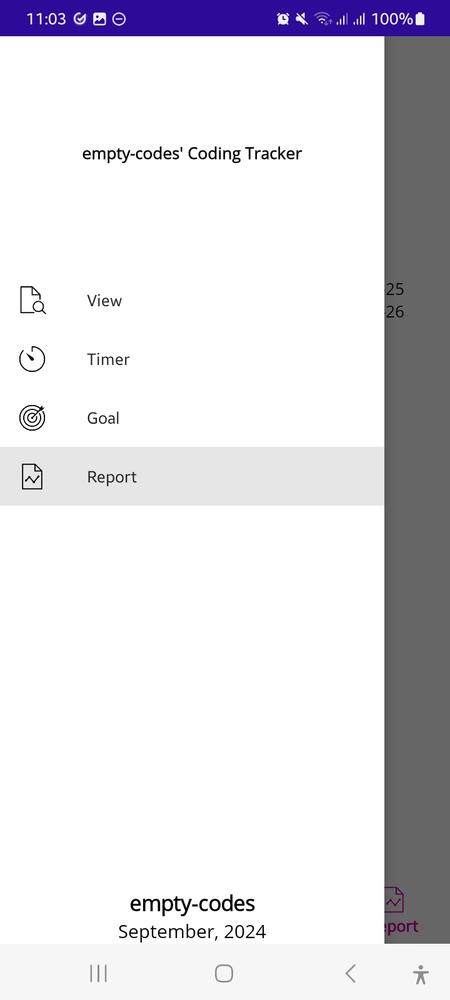
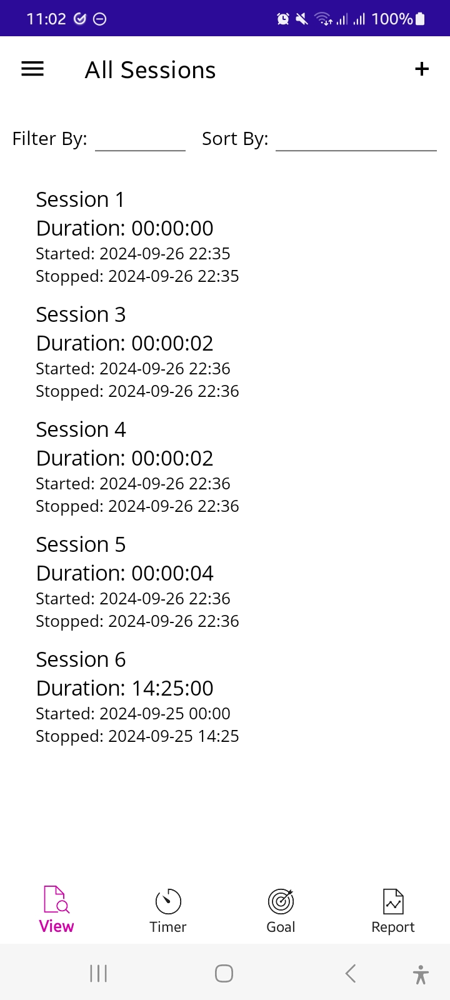
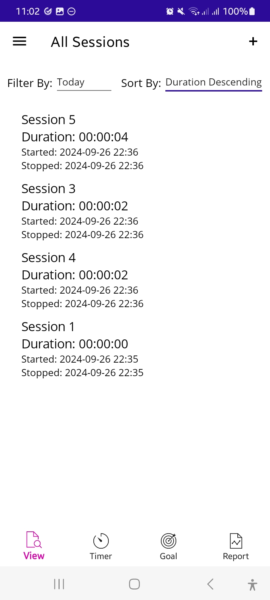
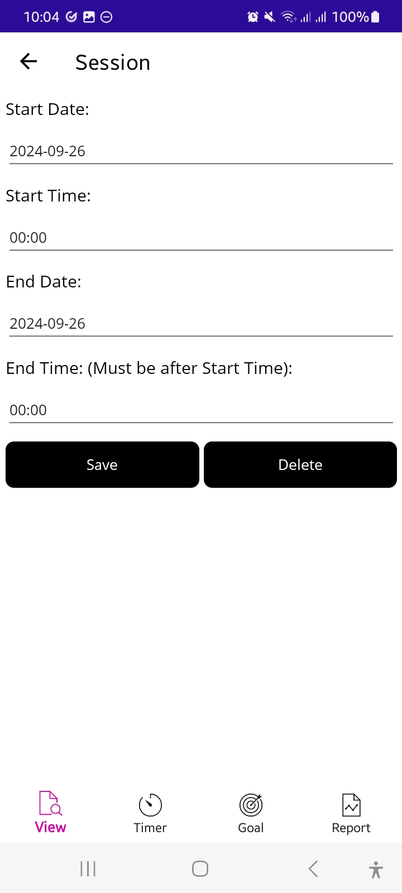
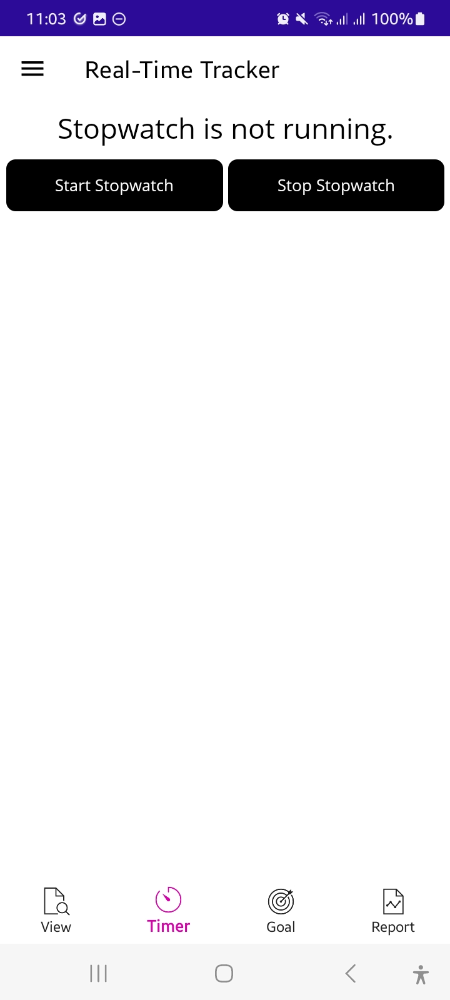
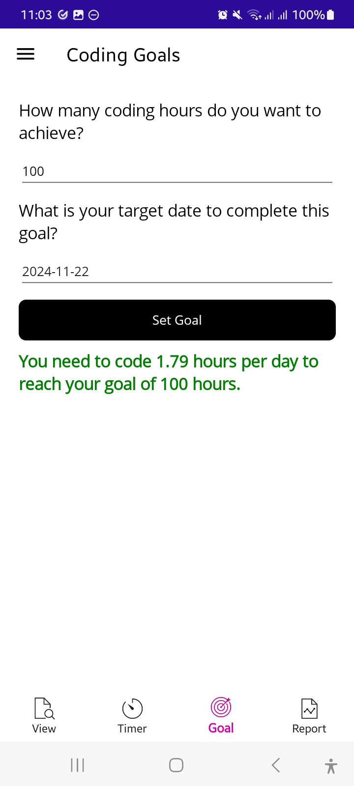
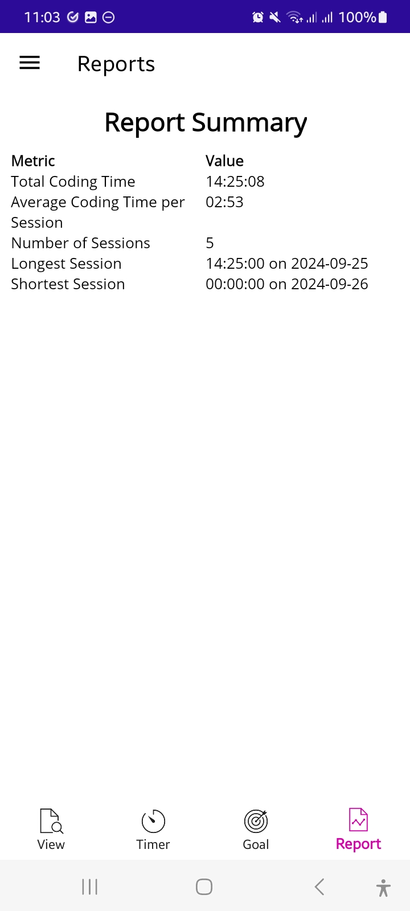

# Coding Tracker

## Overview

**Coding Tracker** is a cross-platform application built with .NET MAUI designed to log and manage coding sessions. Users can add, update, view, and delete coding sessions, as well as generate reports based on their recorded data. The application uses a SQLite database for data storage and the Dapper ORM for data access. It is primarily optimized for mobile (Android).

  
  
  
  
  
  

## Functional Requirements

- **Add Coding Session**: Users can add new coding sessions with start and end times.
- **Update Coding Session**: Users can update existing coding sessions.
- **View All Sessions**: Users can view all recorded coding sessions and filter/sort them accordingly.
- **Delete Coding Session**: Users can delete specific coding sessions.
- **View Report**: Users can view tailored reports of their sessions.
- **Set Goal**: Users can set a coding target (hours) with a deadline.

## Technical Requirements

- **Database**: SQLite
- **ORM**: Dapper
- **Configuration**: used `App.xaml.cs` for database connection and date format settings.

## Features

- **CRUD Operations**: Create, Read, Update, and Delete operations for coding sessions.
- **Date and Time Validation**: Ensures correct date and time formats and logical consistency (e.g., end time must be after the start time).
- **Real-Time Tracking**: Users can track sessions in real time with a stopwatch feature.
- **Coding Goal**: Users can set and track coding goal.
- **Filtering and Sorting**: Users can filter and sort coding sessions by date, time, or duration.
- **Error Handling**: Provides feedback and handles exceptions for incorrect inputs or operations.

## Installation

### Prerequisites

To run this application, ensure you have:

- Visual Studio 2022 with .NET MAUI workloads installed.
- Working emulators or physical devices for testing.

or install the apk in this directory for Android devices

### Running the Project

1. Clone the repository.
2. Open the solution in Visual Studio.
3. Restore NuGet packages.
4. Run the project on an Android emulator or a connected device.
5. Ensure the SQLite database is created at runtime when adding or viewing coding sessions.

## Challenges Faced & Lessons Learned

- Initially thought I could easily copy over code from my previous console-based Coding Tracker, but quickly realized that wasn’t the case.
- Had to adapt to a different environment, like replacing `Ansi.Markup` with `Debug.WriteLine` and using XAML files to create views.
- Learning about data binding was essential and highlighted its importance in UI development.
- Initially created separate pages for the CRUD operations on coding sessions but followed a more efficient pattern found in the official .NET MAUI documentation that used a single page for both saving and deleting sessions.
- Tried implementing MVVM loosely but avoided overcomplicating the project by not adding extra folders like services, opting to place database initialization and creation logic in `App.xaml.cs`.
- Learned to place most of the code in ViewModels rather than the code-behind files, following tutorial guidance to place CRUD methods in the model instead.
- Originally wanted a black-and-white theme, but found it too challenging and instead used system light and dark themes for simplicity.
- Planned to use a `List` to store and retrieve coding sessions as in the console app, but transitioned to using `ObservableCollection`, although `List` was still used in some cases.
- Had only a shallow understanding of `async` and `await` and wasn’t planning to use them, but they ended up being necessary for the app to function correctly.

## Some Issues & Fixes

1. **Navigation to Coding Session Page**: When the "Add Session" button was clicked, it did not navigate to the coding session pag  e.
   **Session List Interaction**: Tapping a session from the list had no effect. I ended up splitting the start and end time into separate date and time entries for easier user input.
   - **Note**: The TimePicker in .NET MAUI only displays hours and minutes by default, even though the format is set to "HH:mm:ss."
   - **Fix**: Registered the page for navigation using routes in `AppShell.xaml.cs`.
   
2. **Real-Time Tracker Session Visibility**: Sessions added via the real-time tracker did not show up in the "View All Sessions" list unless the app was closed and reopened.
   - **Fix**: Ensured that sessions are reloaded every time the AllSessions page is navigated to by creating a LoadSessions() method that would always be called.

3. **Goal Page Crash**: The "Set Goals" page worked on the desktop and during local device testing, but it crashed on the APK when installed on a disconnected Android device.
   - **Fixes**:
     - Changed the `GoalStatus` label from using a static resource converter to creating bool property and binding the label to that property.
     - Registered the route for the goal page in `AppShell.xaml.cs`.
     - Cleared app data, uninstalled the APK, cleaned storage, and reinstalled.

## Areas for Improvement

1. **UI Layout**: The layout is not fully responsive, especially on desktop; more attention to styling is needed.
2. **Goals**: Currently, only one goal can be set, though the values can be modified.
3. **Display Format**: Time durations are displayed as `00:00:00`; they would look better as "00 hours, 00 mins, 00 secs."
4. **Database**: Consider automatic population for a more streamlined experience.
5. **Dark Theme Icons**: The icons are black, which makes them invisible in the dark theme.

## Resources Used

- **Dapper**: [Dapper Documentation](https://github.com/DapperLib/Dapper)
- **Configuration Management**: [ConfigurationManager Class](https://learn.microsoft.com/en-us/dotnet/api/system.configuration.configurationmanager)
- **Spectre Console**: [Spectre Console Documentation](https://spectreconsole.net/)
- **.NET MAUI Docs**: [Microsoft Documentation](https://learn.microsoft.com/en-us/dotnet/maui/what-is-maui?view=net-maui-8.0)
- **Icons8**: [Icons by Icons8](https://icons8.com).

## Thought Process & Reflection

My biggest challenge was setting up .NET MAUI. I encountered multiple installation issues with workloads, and I had to uninstall and reinstall Visual Studio three times before everything worked properly. The debugging process was tedious, but it pushed me to learn more about tools like ADB and logcat for retrieving logs and understanding how navigation works in MAUI apps.

The shift from console development to mobile and desktop apps was harder than I expected. The differences in rendering content and handling user input became much clearer as I worked through this project. I initially struggled to organize the files properly under MVVM, and I learned the importance of separating responsibilities between models, views, and ViewModels.

While the application functions as intended, the UI could use more refinement—especially for desktop layouts. I learnt a whole lot from this so I'm satisfied.
